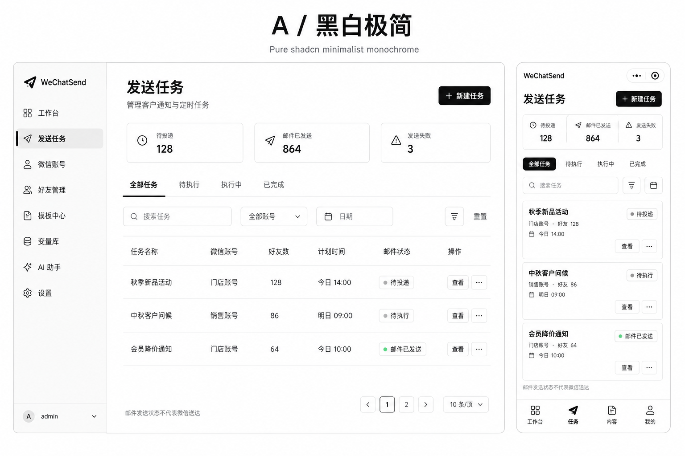
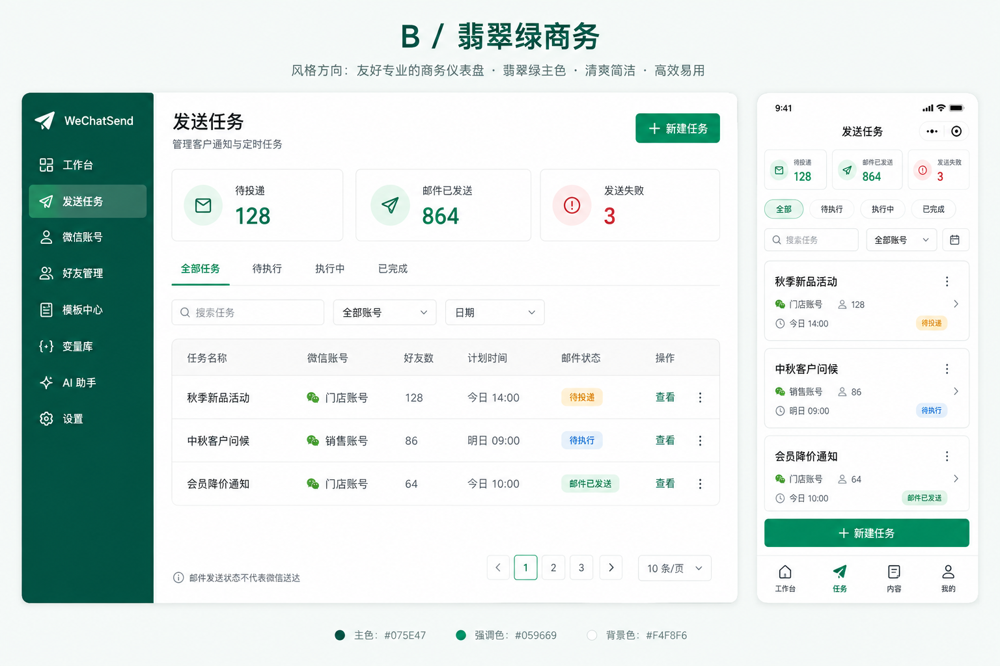
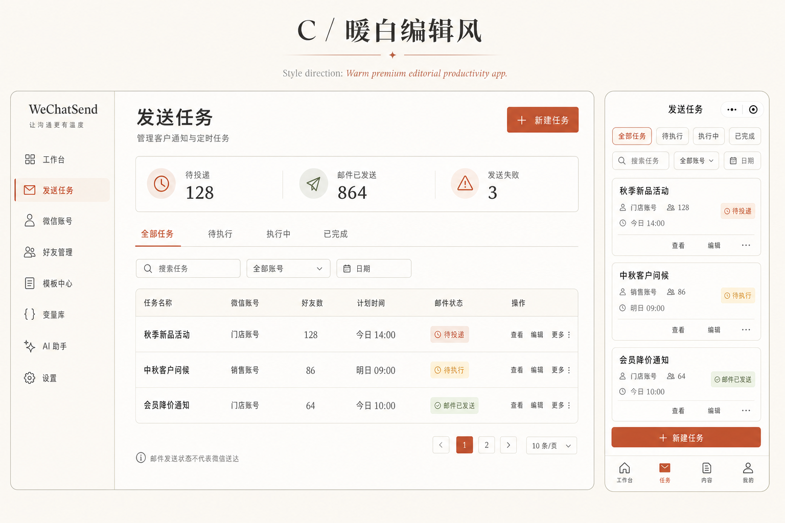
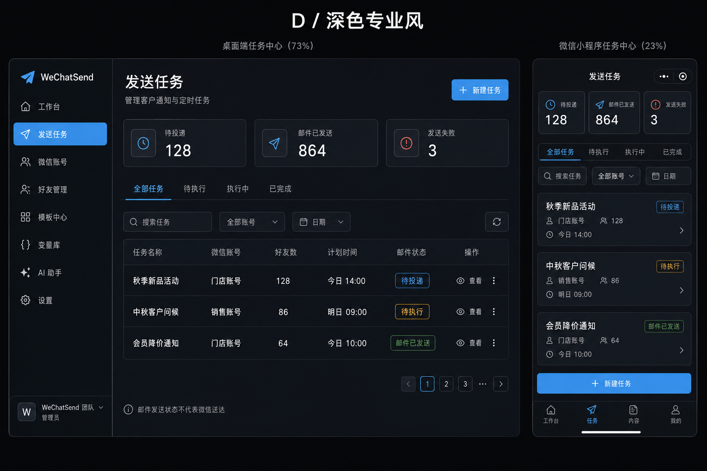

# WeChatSend UI 风格选型

日期：2026-09-07。用户已选定 A 黑白极简。当前准备 MVP 页面设计，页面确认后才开始业务开发。

本轮每张图同时展示 Web 与微信小程序的“发送任务”页。同一内容用于比较颜色、留白、层级、表格/卡片及导航，不以不同功能制造风格差异。小程序与 Web 全部功能对等，当前单页并不代表完整页面集。

| 方案 | 图片 | 视觉方向 |
| --- | --- | --- |
| A 黑白极简 | [查看设计图](./01-A-黑白极简.png) | 最贴近克制的 shadcn/ui，白底、细边框、黑色主按钮、紧凑列表 |
| B 翡翠绿商务 | [查看设计图](./02-B-翡翠绿商务.png) | 深绿导航、浅薄荷底、清晰主按钮、舒适间距 |
| C 暖白编辑风 | [查看设计图](./03-C-暖白编辑风.png) | 米白、陶土色、细分割线，更有亲和力和内容感 |
| D 深色专业风 | [查看设计图](./04-D-深色专业风.png) | 石墨灰、蓝色重点、密集数据层级、低亮度界面 |

选定方案为 A 黑白极简：白底、浅灰导航、细边框、黑色主按钮和紧凑列表。B/C/D 保留为历史候选，不继续作为待选方案。

所有候选均使用内置图像生成工具，未使用 CLI；提示词见 [生成提示词](./生成提示词.md)。这些是位图视觉探索，不是已实现界面；中文细字、数字和行状态如有生成偏差，以页面清单及产品文档为准。

本轮检查：四张均为 1536 × 1024 PNG，已检查双端导航、任务内容及可读性。定稿时需统一的细节：C 的移动页尚未显示统计摘要，任务行“编辑”仅应出现在可编辑草稿；D 底部生成的“团队”不代表增加团队功能；图中计划时间、数量和状态为示例。下一轮会按最终字段和权限校正，不据图片删改已确认功能。

下一轮先按 A 风格设计 MVP 的登录、工作台、发送账号、好友管理、新建任务、任务列表/详情及关键状态；本阶段页面确认后开始 MVP 开发。模板、变量及 AI 页面随相应阶段设计，无需提前画完。范围见 [分阶段开发计划](../docs/分阶段开发计划.md)。Web 用 React + shadcn/ui，小程序用原生组件复现同一视觉规范，每个发布阶段双端功能对等。

## 设计图预览

### A · 黑白极简

### B · 翡翠绿商务

### C · 暖白编辑风

### D · 深色专业风

